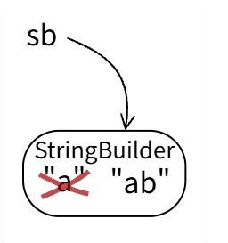
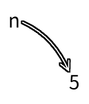
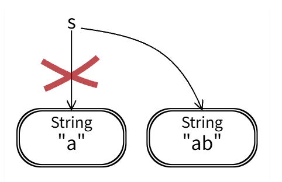
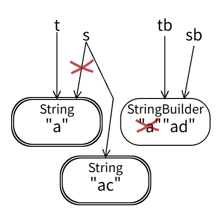

## Types More Detail

There are more differences on structure and memory

* primitive types:
    
    * have no internal structure
    * uses a small, fixed amount of memory
* object types:
    
    * contain internal structure (references to other primitives or objects)
    * use varying, sometimes large amounts of memory

## Mutating values vs. reassigning variables

* immutable type

```java
String s = "a";
s += "b";
```


* mutable type

```java
StringBuilder sb = new StringBuilder("a");
sb.append("b");
```


* unreassignable types

```java
final int n = 5;
```


* reassignable types

```java
String s = "a";
s = "ab";
```



### Below is a good method example of **pass by value**

```java
void f(String s, StringBuilder sb) {
  s.concat("b");
  s += "c";
  sb.append("d");
}

String t = "a";
StringBuilder tb = new StringBuilder(t);
f(t, tb);
```



## == vs. equals()

* The `==` operator compares the values of primitives.
* The `.equals()` method compares the values of objects.
* `==` tests whether the two expressions refer to the same object in memory.

## Java Collections

* A key difference between `List.of` and `ArrayList` is **mutability**. 

Where `List.of("Huey", "Dewey", "Louie")` produces an immutable list of three strings, new `ArrayList<>(List.of("Huey", "Dewey", "Louie"))` produces a mutable list initialized with those strings.

* Warning: be careful **not to mutate a collection while you’re iterating over it**. 

Adding, removing, or replacing elements disrupts the iteration and can even cause your program to crash. 

```python
numbers = [100,200,300]
for num in numbers:
    numbers.remove(num) # danger!!! mutates the list we're iterating over
print(numbers) # list should be empty here -- is it?
```

## Enumerations

enum is a kind of **object type**

```java
public enum PenColor { 
    BLACK, GRAY, RED, PINK, ORANGE, 
    YELLOW, GREEN, CYAN, BLUE, MAGENTA;
}
PenColor drawingColor;
drawingColor = PenColor.RED;

int month = TUESDAY;  //  no error if integers are used
Month month = DayOfWeek.TUESDAY; // static error if enumerations are used 

String color = "REd";        // no error, misspelling isn't caught
PenColor drawingColor = PenColor.REd; // static error when enumeration value is misspelled
```

