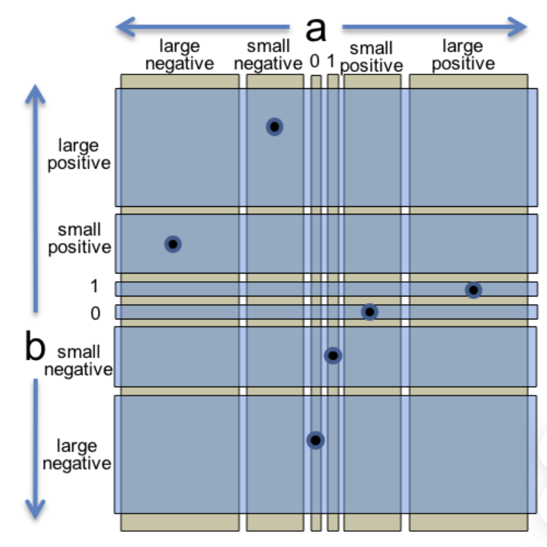

## Test-first programming

* module

a part of a software system that can be designed, implemented, tested, and reasoned about separately from the rest of the system.

* specification

describes the behavior of a module like parm and return

* implementation

A module has an implementation that provides its behavior

* clients

A module has clients that use the module (like every test case)

* test case

* test suite

a set of test cases for a module

### test-first programming in this order

1. **Spec**: Write a specification for the function.

2. **Test**: Write tests that exercise the specification.

3. **Implement**: Write the implementation.

## Systematic testing

**Correct,  Thorough,   Small**

## Choosing test cases by partitioning

We divide the input space into `subdomains`, each consisting of a set of inputs.

Taken together, the subdomains form a `partition`: a collection of disjoint sets that completely covers the input space, so that every input lies in **exactly one** subdomain.

below is some examples to write `partition`:

* express compactly

```java
// partition: a < b; a > b; a = b
```

* include boundaries in the partition

```java
// partition:
//     a = Integer.MIN_VALUE
//     Integer.MIN_VALUE < a < 0
//     a = 0
//     0 < a < Integer.MAX_VALUE
//     a = Integer.MAX_VALUE
```

* using multiple partitions

```java
// partition on a:
//   a = 0
//   a = 1
//   a is small integer > 1
//   a is small integer < 0
//   a is large positive integer
//   a is large negative integer
//      (where "small" fits in long, and "large" doesn't)
// partition on b:
//   b = 0
//   b = 1
//   b is small integer > 1
//   b is small integer < 0
//   b is large positive integer
//   b is large negative integer
// partition on signs of a and b:
//    a and b are both positive
//    a and b are both negative
//    a positive and b negative
//    a negative and b positive
//    one or both are 0
```

the N-dimension test is exponentially increasing, so we try to **cover every subdomain instead of Cartesian-product**.

below is how 6 tests cover all 6 * 6 * 5 subdomains



## Documenting your testing strategy

* we write partition in the start of the `Test.class`

```java
public class MaxTest {
  /*
   * Testing strategy
   *
   * partition:
   *    a < b
   *    a > b
   *    a = b
   */
```

* we write coverage above each test case

```java
  // covers a < b
  @Test
  public void testALessThanB() {
      assertEquals(2, Math.max(1, 2));
  }
```

## Black box and glass box testing

**Black box testing** means choosing test cases only from the specification, not the implementation of the function. 

That's what we do so far.

**Glass box testing** means choosing test cases with knowledge of how the function is actually implemented.

For example, if the implementation selects different algorithms depending on the input, then you should partition around the points where different algorithms are chosen. If the implementation keeps an internal cache that remembers the answers to previous inputs, then you should test repeated inputs.

## Coverage

* Statement coverage

is every statement run by some test case?

* Branch coverage

every `if` and `while` test both true and false?

* Path coverage

is every possible combination of branches taken by some test case?

## Unit and integration and automated regression testing

**unit test**: test a single module in isolation

**integration test**: test a combination of modules or even the entire program

*we like use **mock object** to make the test as unit as it could be.*

**regression testing**: run all your tests after every change.

